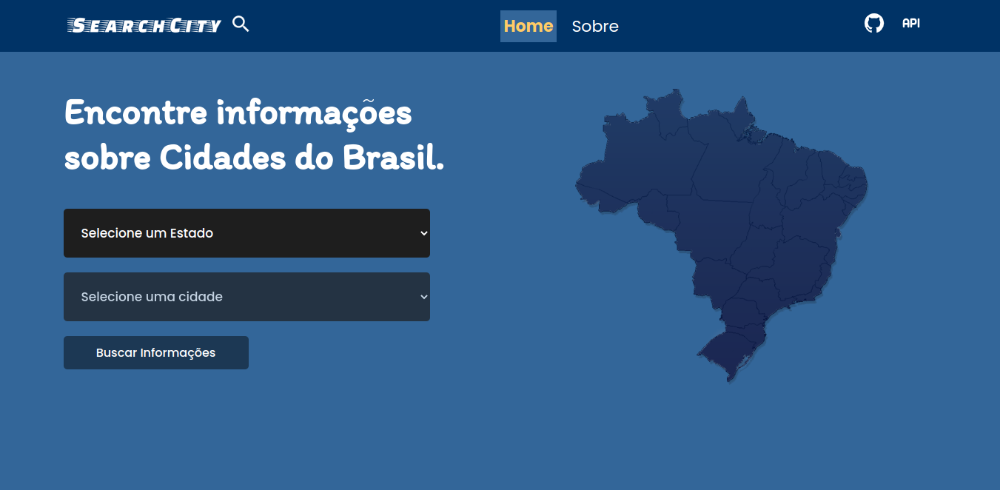

# SearchCity

## Description

O **searchCity** é uma aplicação front-end, que utiliza a APIs do IBGE para encontrar informações sobre cidades do Brasil. 
A aplicação é construida utilizando **react** com **typescript**, a estilização é feita com **style-components** e o roteamento das página com **react-router-dom** na versão 6.9. além disso, o gerenciamento de estado é feito com o próprio **contextAPI** do react.

## Tools

Ferramentas utilizadas no desenvolvimento.

ReactJs  
[@ReactJs](https://www.npmjs.com/package/@reactjs)

TypeScript  
[@TypeScript](https://www.typescriptlang.org/)

Styled Components  
[@Styled-Components](https://styled-components.com/)

API de Estados e Cidades  
[@IBGE-Localidades](https://servicodados.ibge.gov.br/api/docs/localidades)

API dos mapas das Cidades  
[@IBGE-Malhas](https://servicodados.ibge.gov.br/api/docs/malhas?versao=3#api-Malhas-municipiosIdGet)
